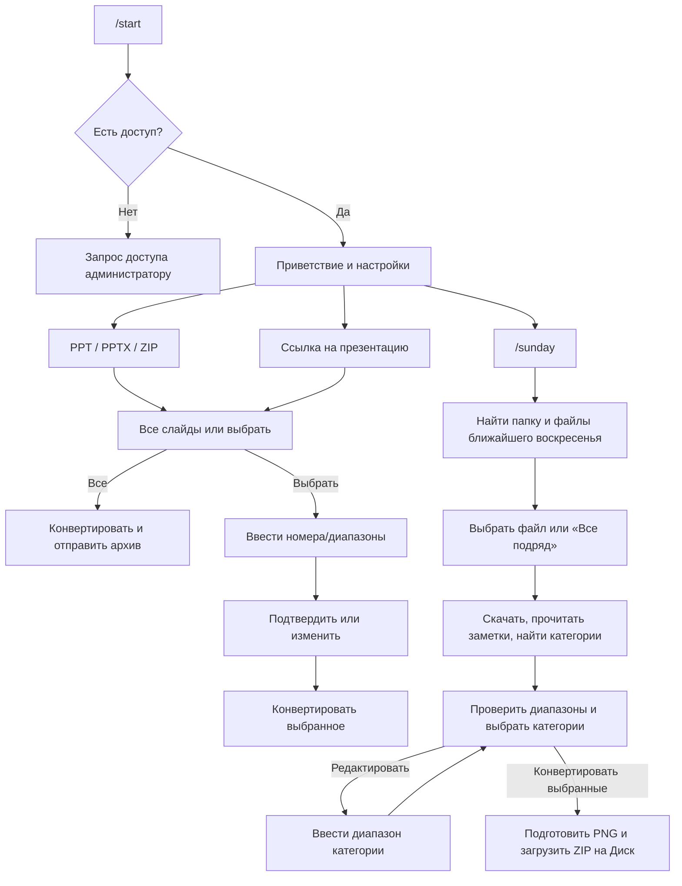

# Сценарии взаимодействия пользователя с ботом

**Статус:** описание текущего поведения кода  
**Обновлено:** 06.10.2026

Документ описывает пользовательские диалоги Telegram-бота: команды, загрузку
файлов и ссылок, выбор диапазонов, сценарий `/sunday`, отмену и типовые ошибки.
Тексты ниже передают содержание сообщений и кнопок; длинные имена файлов,
пути и числа в примерах условные. Inline-кнопки показаны строками в квадратных
скобках, как визуальный макет, а не как отдельное сообщение.

## Краткая карта сценариев



## Команды

| Команда | Поведение |
|---|---|
| `/start` | Проверяет доступ и показывает приветствие, статус Яндекс.Диска и настройки. При доступном Диске может показать наличие презентаций на ближайшее воскресенье. |
| `/sunday` | Ищет на Яндекс.Диске структуру папок и презентации на ближайшее воскресенье, затем открывает меню выбора файлов. |
| `/cancel_yd` | Сбрасывает текущую сессию Яндекс.Диска и запрашивает отмену активной задачи. |

Для обычной конвертации отдельной команды не требуется: пользователь отправляет
файл или ссылку в чат.

## Стартовый экран и настройки

При наличии доступа `/start` показывает состояние подключения и общие
настройки пользователя. Наличие Яндекс-презентаций зависит от доступа к Диску
и папок ближайшего воскресенья.

Пример:

```text
👋 Привет!

🟢 Яндекс.Диск: ✅ Доступен
📅 На 11.10.2026 найдено pptx: 2
→ /sunday для выбора

Загрузите презентацию, отправьте ссылку или используйте /sunday.

⚙️ Настройки:

[Standard] [✅ 2K] [4K]
[Возвращать PDF: ❌ Нет (Только ZIP)]
[🎯 Проповедь: ✅] [🎬 Начало: ✅] [📄 Остальные: ❌]
```

Качество, выдача PDF и категории по умолчанию переключаются нажатием кнопок.
Настройки категорий задают начальные отметки, но не заменяют выбор категорий
в конкретном сценарии `/sunday`.

Если у пользователя нет доступа, бот направляет администратору запрос с
кнопками `✅ Разрешить` и `❌ Отклонить`. После разрешения пользователь может
повторно выполнить `/start`.

## Отправка PPT/PPTX/ZIP или ссылки

### Загрузка файла

Поддерживаются `.ppt`, `.pptx` и `.zip`. ZIP должен содержать презентацию.
После загрузки пользователь получает меню:

```text
📄 Файл 'presentation.pptx' загружен.

Вы можете сразу ввести номера слайдов в чат или выбрать вариант ниже:

[📊 Все слайды] [📝 Выбрать слайды]
```

Для ZIP файл распаковывается; если презентация внутри не найдена, бот сообщает
об ошибке. Неподдерживаемые типы файлов отклоняются с сообщением:

```text
❌ Поддерживаются только PPTX, PPT и ZIP.
```

### Отправка ссылки

Бот скачивает презентацию по URL (в том числе с Яндекс.Диска), затем показывает
такой же выбор:

```text
📄 Файл загружен по ссылке.

Вы можете сразу ввести номера слайдов в чат или выбрать вариант ниже:

[📊 Все слайды] [📝 Выбрать слайды]
```

Если файл по ссылке скачать не удалось:

```text
❌ Не удалось скачать файл по ссылке.
```

### Все слайды

Нажатие `📊 Все слайды` начинает конвертацию всей презентации. После завершения
бот отправляет ZIP со слайдами и, если включена соответствующая настройка, PDF.

### Выбор слайдов вручную

Нажатие `📝 Выбрать слайды` просит отправить номера в чат:

```text
📝 Введите номера слайдов для конвертации.

Формат ввода:
• Отдельные номера: 1, 3, 5, 7
• Диапазоны: 4-12, 15, 20-30
• Смешанный: 1, 3-5, 10, 15-20

Если указать несколько диапазонов, каждый будет упакован в отдельный архив.
```

После ввода, например `1, 3-5, 10`, пользователь видит подтверждение:

```text
📊 Вы выбрали: 1, 3-5, 10

3 архив(ов).
Нажмите 'Конвертировать'.

[✅ Конвертировать] [✏️ Изменить]
```

`✏️ Изменить` возвращает к вводу диапазонов. Если формат некорректен, бот
показывает допустимый пример и ожидает новый ввод. Диапазоны нумеруются с 1.

## Сценарий `/sunday`

### Поиск программы и список файлов

Команда проверяет подключение к Яндекс.Диску, вычисляет ближайшее воскресенье,
ищет соответствующие папки и презентации. В меню выбора показываются дата,
путь и найденные файлы:

```text
📅 Ближайшее воскресенье: 11.10.2026
📍 Папка: /.../ОКТЯБРЬ/11.10.2026/Служение

📄 Найдено файлов: 2

1. Служение 11.10.26.pptx — 4.2 МБ
2. Проповедь 11.10.26.pptx — 2.1 МБ

🎬 Выберите файл для обработки:

[🎯 Служение 11.10.26.pptx]
[📄 Проповедь 11.10.26.pptx]
[📁 Все подряд]
[❌ Отмена]
```

Кнопка `📁 Все подряд` отображается, если найдено больше одного файла.
`❌ Отмена` прекращает выбор. Если структура папок или файлы не найдены,
бот сообщает об этом вместо меню.

### Анализ и меню категорий

После выбора бот скачивает презентацию, определяет число слайдов и анализирует
заметки докладчика. Для каждой категории строится автоматический диапазон,
если найдены подходящие пометки. Пользователь проверяет результат, меняет
отметки и подтверждает конвертацию.

Пример, когда категории найдены:

```text
🎬 Выбор категорий для конвертации

📄 Файл: Служение 11.10.26.pptx
📌 Всего слайдов: 42

🌅 Начало: 1–4 (4 с.)
🙏 Молитва: 5–6 (2 с.)
🎯 Проповедь: 12–35 (24 с.)

📄 Остальные: 12 с.

🎯 Отметьте категории для конвертации:
диапазон любой категории можно изменить вручную кнопкой «Изменить диапазон».

[✅ 🌅 Начало (1–4, 4 с.)]
[✅ 🙏 Молитва (5–6, 2 с.)]
[✅ 🎯 Проповедь (12–35, 24 с.)]
[⬜ 📄 Остальные (12 с.)]
[✏️ Изменить диапазон]
[✅ Конвертировать выбранные (30 с.)]
[❌ Отменить задачу]
```

Отметка категории переключается нажатием строки. «Остальные» — слайды, не
отнесённые к найденным диапазонам. Набор категорий по умолчанию зависит от
персональных настроек.

### Если пометка или диапазон не найдены

Категория отображается как ненайденная, а её строка пока не переключается.
Кнопка изменения диапазона остаётся доступной; по нажатию пользователь может
выбрать категорию и задать диапазон вручную:

```text
⚠️ Ни одна категория не найдена автоматически.

📄 Остальные: 42 с.
🎯 Отметьте категории для конвертации:
Диапазон любой категории можно изменить вручную кнопкой «Изменить диапазон».

[⚫ 🌅 Начало — не найдено]
[⚫ 🙏 Молитва — не найдено]
[⚫ 🎯 Проповедь — не найдено]
[✅ 📄 Остальные (42 с.)]
[✏️ Изменить диапазон]
[✅ Конвертировать выбранные (42 с.)]
[❌ Отменить задачу]
```

После нажатия открывается список категорий:

```text
✏️ Выберите категорию для изменения диапазона

📄 Файл: Служение 11.10.26.pptx
📊 Всего слайдов: 42

[🌅 Начало (не задан)]
[🙏 Молитва (не задан)]
[🎯 Проповедь (не задан)]
[↩️ Назад]
[❌ Отменить задачу]
```

### Ручное редактирование категории

Нажатие категории в этом списке заменяет меню запросом ввода диапазона:

```text
✏️ Укажите диапазон: Проповедь

📄 Файл: Служение 11.10.26.pptx
📊 Всего слайдов: 42
Текущий диапазон: не задан

Формат: 5-30 или 5,7,10-15
Отправьте диапазон сообщением в чат. Можно указать несколько диапазонов через запятую.
Для возврата без изменений отправьте «отмена».
```

Пример ввода `10-32, 38` обновит диапазон «Проповедь», отметит её для
конвертации и вернёт к меню категорий. Введённые номера ограничиваются
фактическим количеством слайдов; бот сообщает, если диапазон был укорочен или
номер слайда не существует. Некорректный формат не меняет сохранённый диапазон,
бот просит повторить ввод.

Отправка `отмена` или `cancel` при редактировании возвращает к меню без
изменений. В этом контексте `0` не является отменой редактирования.

### Подтверждение, файлы и завершение

Нажатие `✅ Конвертировать выбранные` подтверждает категории для текущего
файла. Если команда была запущена для нескольких презентаций, затем показывается
меню следующего неподтверждённого файла. Когда выбор завершён, бот
конвертирует слайды, упаковывает выбранные категории в ZIP и загружает их в
соответствующие папки Яндекс.Диска. Категория «Остальные» сохраняется в папку
общих результатов конвертации. В итоговом сообщении перечисляются результаты
и ссылки на созданные файлы.

Если ничего не выбрано, бот показывает предупреждение и оставляет меню для
повторного выбора. Активное действие можно прервать кнопкой `❌ Отменить
задачу` или командой `/cancel_yd`.

## Отмена и ошибки

| Ситуация | Что видит пользователь |
|---|---|
| Яндекс.Диск не настроен | Предложение обратиться к администратору; `/sunday` недоступна. |
| Нет доступа к Яндекс.Диску | Сообщение о недоступности и причина, если она известна. |
| Структура папок воскресенья не найдена | Ожидаемая структура каталогов и дата. |
| В папке нет презентаций | Сообщение, что PPTX на выбранную дату не найдены. |
| Выбрана кнопка устаревшей сессии | Сообщение, что сессия неактивна/истекла. |
| Ответил не владелец задачи | Callback-операция отклоняется с сообщением об отсутствии доступа. |
| Ожидание подтверждения истекло | Бот сообщает об истечении времени и очищает временные файлы. |
| Активная задача отменяется | Бот подтверждает запрос отмены; очистка выполняется после безопасного завершения текущего шага. |
| Повторный `/sunday` во время работы | Бот сообщает, что уже есть активная задача, и предлагает дождаться либо отменить её. |

Ввод диапазона в сценарии `/sunday` отправляется сообщением в тот же чат;
если ожидается несколько диапазонов в разных активных задачах, нужно ответить
реплаем на конкретный запрос диапазона.

## Связанные документы

- [ARCHITECTURE.md](./ARCHITECTURE.md) — устройство компонентов и границы модулей.
- [obs_local/README.md](./obs_local/README.md) — локальный режим OBS.

При изменении команд, текста меню, кнопок, правил выбора диапазонов или обработки
ошибок обновляйте этот документ вместе с кодом.
